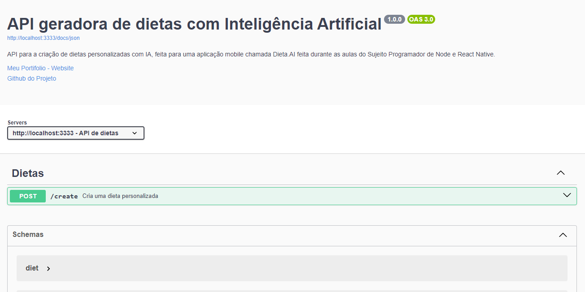

# API geradora de dietas com IA


## Sobre ✏️
### Este é o servidor de uma aplicação chamada [Dieta.AI](https://github.com/Paulo-Mikhael/dietaai-mobile?tab=readme-ov-file#readme), responsável por criar uma dieta personalizada para o usuário, a dieta é criada com o auxílio da API do google gemini, e ao passar os dados como nome, peso etc, é enviado um prompt com essas informações à IA, que retorna a dieta em formato de json. Ao rodar a aplicação localmente, a documentação da API estará disponível na url [http://localhost:3333/docs](http://localhost:3333/docs).

## Tecnologias 💻
<div>
  <abbr title="Node.js - Runtime Javascript">
    
  </abbr>
  <abbr title="Typescript - Linguagem fortemente tipada">
    
  </abbr>
  <abbr title="Fastify - Framework back-end" >
    
  </abbr>
</div>

## Bibliotecas 📚
<div>
  <abbr title="Google Gemini - API do Google Gemini, inteligência artificial da google" >
    
  </abbr>
</div>

## Estrutura principal do Projeto 🗃️
```plaintext
src
├── controllers/
│   └── CreateNutrition.ts
├── services/
│   └── CreateNutritionService.ts
├── routes.ts
└── server.ts
```
### Descrição:
- src - Contém todos os componentes da aplicação;
- controllers - Contém as funções que lidam com a requisição http que o usuário fez, para depois usar a lógica de negócio de services;
- services - Contém as funções responsáveis por toda a lógica de negócio que faz a aplicação funcionar;
- routes.ts - Fica as rotas http para acessar a API;
- server.ts - Inicia um servidor localmente, e também carrega a documentação da API;

## Rodando Localmente (Prompt) 📟
### Clone o projeto
```bash
  git clone https://github.com/Paulo-Mikhael/dietaai-backend
```
### Entre no diretório do projeto
```bash
  cd dietaai-backend
```
### Instale as dependências
```bash
  npm install
```
### Inicie o servidor
```bash
  npm run dev
```

## Rotas 🗺️
### Caso tenha seguido todos os passos de "[Rodando Localmente](#rodando-localmente-prompt-)", a documentação da API estará disponível na url [http://localhost:3333/docs](http://localhost:3333/docs)
### Criar dieta:
```bash
  POST "/create"
  Content-Type: application.json
  body: {
    name: string;
    weight: string;
    height: string;
    age: string;
    gender: string;
    objective: string;
    level: string;
  }
```

## Talvez você queira ver 💡
  ### [Portifólio](https://portifolio-react-three.vercel.app/)
  ### [Currículo](https://docs.google.com/document/d/1xhimUtV6EM7c1GtwBwAHsIonX1HjoLSi/edit)

## Confira meus outros projetos 🛠️
  - [in.orbit (back-end) - API de metas](https://github.com/Paulo-Mikhael/in-orbit-backend?tab=readme-ov-file#readme)
  - [in.orbit (front-end) - Aplicação de metas pessoais](https://github.com/Paulo-Mikhael/in-orbit-frontend?tab=readme-ov-file#readme)
  - [Blog PHLOX - Blog de uma empresa de tecnologia](https://github.com/Paulo-Mikhael/phlox-blog?tab=readme-ov-file#readme)
  - [Fastask - Gerenciador de Tarefas](https://github.com/Paulo-Mikhael/fastask?tab=readme-ov-file#readme)
  - [Landing Page para uma academia](https://github.com/Paulo-Mikhael/academia-landing-page?tab=readme-ov-file#readme)
  - [Landing Page para um e-commerce de tech](https://github.com/Paulo-Mikhael/phlox?tab=readme-ov-file#readme)

## Contatos 📞
  [](https://portifolio-react-three.vercel.app/contacts)
  [](https://www.linkedin.com/in/paulo-miguel-4b706022b/)
  [](https://www.instagram.com/pa__miguel?igsh=MWxoYzdqNGluZWcyaA%3D%3D)
  [](https://api.whatsapp.com/send/?phone=5592992813253&text=Ol%C3%A1%21+Gostaria+de+fazer+uma+oferta...&type=phone_number&app_absent=0)